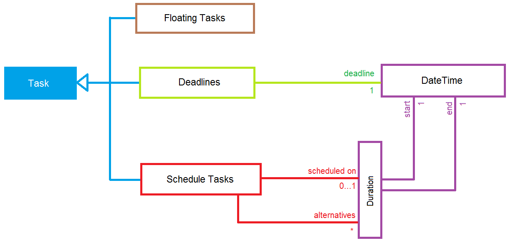
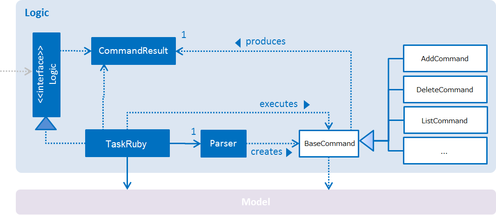
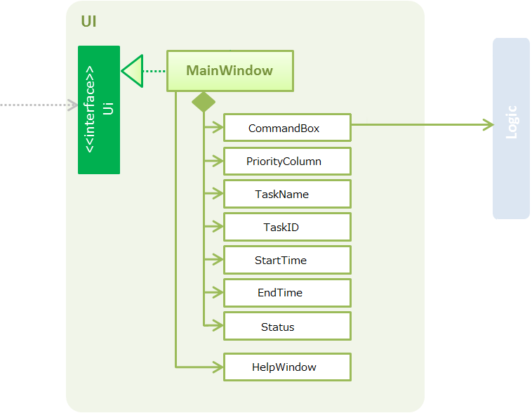
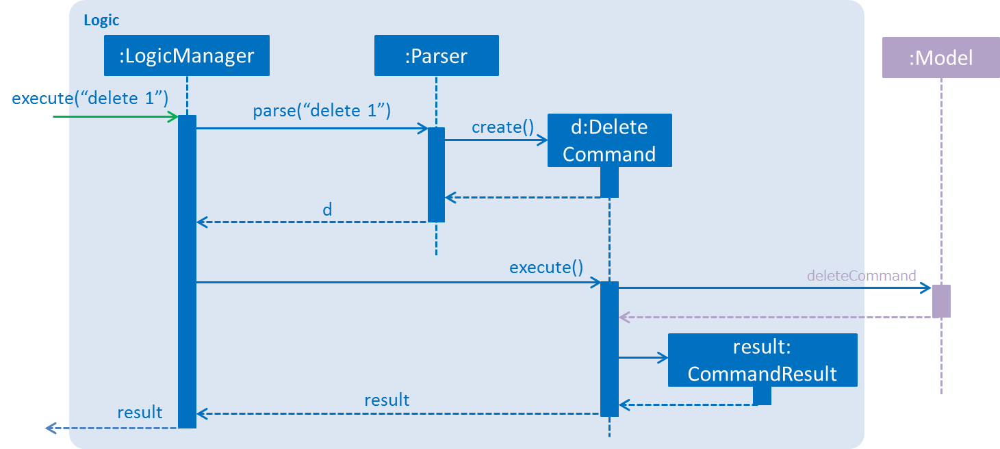
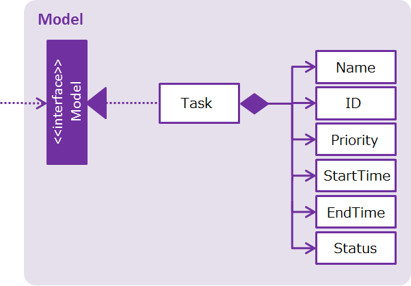
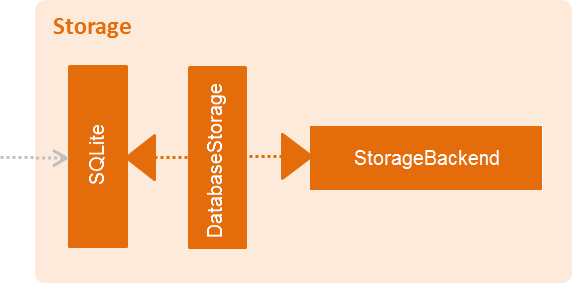

Developer Guide
===============

-   [Introduction](#introduction)
-   [Setting Up](#setting-up)
-   [Design](#design)
-   [Implementation](#implementation)
-   [Testing](#testing)
-   [Dev Ops](#dev-ops)
-   [Appendix A: User Stories](#appendix-a-user-stories)
-   [Appendix B: Use Cases](#appendix-b-use-cases)
-   [Appendix C: Non Functional Requirements](#appendix-c-non-functional-requirements)
-   [Appendix D: Glossary](#appendix-d-glossary)
-   [Appendix E: Product Survey](#appendix-e-product-survey)

<!-- @@author A0108515L -->
INTRODUCTION
------------

TaskRuby is a simple tool for busy professionals to schedule and manage
their daily to-do tasks! It is a Java desktop application that allows
efficient interaction with a GUI and does not require connection to the
Internet. It is developed with a command-line interface approach.

This guide describes the design and implementation of TaskRuby. It will
help you understand how TaskRuby works and how you can further
contribute to its development.

 

Figure 1: OO Domain Diagram

SETTING UP
----------

#### Prerequisites

1.  **JDK** `1.8.0_60` or later

> Any Java 8 version is not enough. The app will not work with earlier
> versions of Java 8.

2.  **Eclipse** IDE

3.  **e(fx)clipse** plugin for Eclipse (Do from step 2 onwards given in
    [this
    page](http://www.eclipse.org/efxclipse/install.html#for-the-ambitious))

4.  **Buildship Gradle Integration** plugin from the Eclipse Marketplace

#### Importing the project into Eclipse

1.  Fork this repo, and clone the fork to your computer

2.  Open Eclipse (Note: Ensure you have installed the **e(fx)clipse**
    and **buildship** plugins as given in the prerequisites above)

3.  Click `File` > `Import`

4.  Click `Gradle` > `Gradle Project` > `Next` > `Next`

5.  Click `Browse`, then locate the project's directory

6.  Click `Finish`

> -   If you are asked whether to 'keep' or 'overwrite' config files, choose to 'keep'.

> -   Depending on your connection speed and server load, it can even take up to 30 minutes for the set up to finish. (This is because Gradle downloads library files from servers during the project set up process.)

> -   If Eclipse auto-changed any settings files during the import process, you can discard those changes.

DESIGN
------

### Architecture

 

*Figure 2: Activity Diagram of TaskRuby*

Figure 2 gives a high-level design overview of TaskRuby. A quick
overview of each component follows.

`Models` has only one class called Task. It is responsible for
initializing the components in the correct sequence, and connecting them
up with each other.

Our event handler, `TaskController`, is a class that plays an
integral role at the architecture level.

-   TaskController : This class is used by components to communicate
    with other components using events (i.e. a form of *Event
    Driven* design).

The rest of TaskRuby consists of these four components,

-   `UI` : Displays UI of the App.

-   `Logic` : Executes the command.

-   `Model` : Holds the data of the App in-memory.

-   `Storage` : Reads data from, and writes data to, the hard disk.

Each of the four components defines its API in a specified class.

For example, the `Logic` component (see Figure 3) defines its API in
the `TaskRuby.java` class.

 

*Figure 3: Class Diagram of the* `Logic `*component*

<!-- @@author A0118894N -->

### UI component

 

*Figure 4: Class Diagram of the* `UI `*component*

**API** :
[UI.java](file:///E:\Desktop%20Stuff\CS2101\src\main\java\seedu\address\ui\Ui.java)

The UI consists of a `MainWindow` that is made up of parts e.g.
`CommandBox`, `TaskName`, `Priority`, `Status` etc. All these parts are
loaded on start-up.

The `UI` component uses JavaFx UI framework. The layout of these UI
parts are defined in `.fxml` files that are in the
`src/main/java/views` folder. For example, the layout of the
MainWindow is loaded from TaskRubyIdea.fxml.

The `UI` component executes user commands using the `Logic` component.
It also binds itself to some data in the `Model` so that the user
interface can auto-update when data in the `Model` changes. The `UI`
responds to events raised from various parts of TaskRuby and updates the
user interface accordingly.

### Logic component

 

*Figure 5: Class Diagram of the* `Logic `*component*

**API** :
[Logic.java](file:///E:\Desktop%20Stuff\CS2101\src\main\java\seedu\address\logic\Logic.java)

`Logic` uses the `Parser` class to parse the user command. The command
execution can affect the `Model` (e.g. adding a task) and/or raise
events. The result of the command execution is encapsulated as a
`BaseCommand` object which is passed back to the `UI`.

Figure 6 below illustrates the Sequence Diagram for interactions within
the `Logic` component for the `execute("delete 1")` API call.

 

*Figure 6: Sequence Diagram of interactions within the* `Logic `*component*

### Model component

 

*Figure 7: Class Diagram of the* `Model `*component*

**API** :
[Model.java](file:///E:\Desktop%20Stuff\CS2101\src\main\java\seedu\address\model\Model.java)

The `Model` stores a `Task` object that represents the task’s properties
and the Task Manager data. `Model` does not depend on any of the other
three components.

### 

### 

### Storage component

 

*Figure 8: Class Diagram of the* `Storage `*component*

**API** :
[Storage.java](file:///E:\Desktop%20Stuff\CS2101\src\main\java\seedu\address\storage\Storage.java)

The `Storage` component can save `UserPref` objects in json format and
read it back. It can also save the Address Book data in xml format and
read it back.

<!-- @@author A0108515L -->

IMPLEMENTATION
--------------

### Logging

We are using `java.util.logging` package for logging.

**Logging Levels**

-   `SEVERE` : Critical problem detected which may possibly cause the
    termination of TaskRuby

-   `WARNING` : Precaution measures to be taken when continuing

-   `INFO` : Information showing the noteworthy actions by TaskRuby

-   `FINE` : Details that is not usually noteworthy but may be useful in
    debugging e.g. print the actual list instead of just its size

TESTING
-----------------------------------------------------------------------------------------------

Tests can be found in the `./src/test/java` folder.

**In Eclipse**:

If you are not using a recent Eclipse version (i.e. *Neon* or later),
enable assertions in JUnit tests as described
[here](http://stackoverflow.com/questions/2522897/eclipse-junit-ea-vm-option).

-   To run all tests, right-click on the `src/test/java` folder and
    choose `Run as` > `JUnit Test`

-   To run a subset of tests, you can right-click on a test package,
    test class, or a test and choose to run as a JUnit test.

**Using Gradle**:

See
[UsingGradle.md](file:///E:\Desktop%20Stuff\CS2101\CA3)%20Product%20Manual%20UG%20and%20DG\UsingGradle.md)
for how to run tests using Gradle.

We have two types of tests:

1.  **GUI Tests** - These are *System Tests* that test the entire App by
    simulating user actions on the GUI. These are in the
    `guitests` package.

2.  **Non-GUI Tests** - These are tests not involving the GUI. They
    include,

-   *Unit tests* targeting the lowest level methods/classes. e.g.
    AddCommandTest.java

-   *Integration tests* that are checking the integration of multiple
    code units (those code units are assumed to be working).

-   Hybrids of unit and integration tests. These test are checking
    multiple code units as well as how they are connected together.

**Headless GUI Testing**: Thanks to the
[TestFX](https://github.com/TestFX/TestFX) library we use, our GUI tests
can be run in the headless mode. In the headless mode, GUI tests do not
show up on the screen. That means the developer can do other things on
the Computer while the tests are running. See
[UsingGradle.md](file:///E:\Desktop%20Stuff\CS2101\CA3)%20Product%20Manual%20UG%20and%20DG\UsingGradle.md#running-tests)
to learn how to run tests in headless mode.

<!-- @@author -->

DEV OPS
-------

### Build Automation

See
[UsingGradle.md](file:///E:\Desktop%20Stuff\CS2101\CA3)%20Product%20Manual%20UG%20and%20DG\UsingGradle.md)
to learn how to use Gradle for build automation.

### Continuous Integration

We use [Circle CI](https://travis-ci.org/) to perform *Continuous
Integration* on our projects.

### Making a Release

Here are the steps to create a new release.

1.  Generate a JAR file [using
    Gradle](file:///E:\Desktop%20Stuff\CS2101\CA3)%20Product%20Manual%20UG%20and%20DG\UsingGradle.md#creating-the-jar-file).

2.  Tag the repo with the version number. e.g. `v0.1`

3.  [Create a new release using
    GitHub](https://help.github.com/articles/creating-releases/) and
    upload the JAR file your created.

### Managing Dependencies

A project often depends on third-party libraries. For example, Address
Book depends on the [Jackson
library](http://wiki.fasterxml.com/JacksonHome) for XML parsing.
Managing these *dependencies* can be automated using Gradle. For
example, Gradle can download the dependencies automatically, which is
better than these alternatives.

a. Include those libraries in the repo (this bloats the repo size)

b. Require developers to download those libraries manually (this creates
extra work for developers)

<!-- @@author A0130164W -->

APPENDIX A: USER STORIES 
------------------------

Priorities: High (must have) - `* * *`, Medium (nice to have) - `* *`, Low (unlikely to have) - `*`

  Priority  | As a ...                          | I want to ...                          | So that I can...
  ----------| ----------------------------------| ---------------------------------------| ---------------------------------------------
  `* * *`   | new user                          | see usage instructions                 | refer to instructions when I forget how to use TaskRuby
  `* * *`   | user                              | add a new task                         | see my task in TaskRuby
  `* * *`   | user                              | delete a task                          | remove entries that I no longer need
  `* * *`   | user                              | undo latest command                    | update task list quickly if there is a change-of-mind
  `* * *`   | user                              | edit a task                            | update task entry with fresh information without deleting and then adding
  `* * *`   | user                              | find a task by name                    | locate details of task without having to go through the entire list
  `* * *`   | user                              | add task without deadlines             | track tasks that has no deadline and just need to be done “someday”
  `* * *`   | user                              | mark tasks that are already completed  | keep track of what I have done
  `* *`     | user                              | hide list of tasks by default          | minimize chance of someone else seeing them by accident
  `* *`     | user                              | duplicate a task that recurs weekly    | minimize number of additions for a recurring task
  `*`       | user with many tasks in TaskRuby  | sort tasks by name                     | locate a task easily
  `*`       | user                              | have a backup of my schedule           | make a recovery from the backup in case of a software or hardware crash

APPENDIX B: USE CASES 
---------------------

(For all use cases in this section, the **System** is TaskRuby and the
**Actor** is the user, unless specified otherwise)

#### Use case: Add task

**MSS**

1.  User requests to add task

2.  TaskRuby adds the task.
    > Use case ends.

**Extensions**

1a. Invalid syntax for command

> 1a1. TaskRuby shows an error message.
>
> > Use case ends

#### Use case: Find task with keywords

**MSS**

1.  User requests to list tasks matching keywords

2.  TaskRuby shows a list of tasks matching keywords.
    > Use case ends.

**Extensions**

2a. No matching tasks

> 2a1. TaskRuby shows an error message.
>
> > Use case ends

#### Use case: Delete task

**MSS**

1.  User requests to list tasks

2.  TaskRuby shows a list of tasks

3.  User requests to delete a specific task in the list

4.  TaskRuby deletes the task.
    > Use case ends.

**Extensions**

2a. The list is empty
    > Use case ends

3a. The given index is invalid

> 3a1. TaskRuby shows an error message.
>
> 3a2. Use case resumes at step 2.

#### Use case: Undo latest command

**MSS**

1.  User requests to add or delete task.

2.  User requests to undo latest command.

3.  TaskRuby undoes the latest command.
    > Use case ends.

**Extensions**

2a. Latest command is add task

> 2a1. TaskRuby delete last added task.
>
>> Use case ends.

2b. Latest command is delete task

> 2b1. TaskRuby adds last deleted task.
>
>> Use case ends.

2c. Latest command is invalid
    > Use case ends

<!-- @@author A0144017R -->

APPENDIX C: NON FUNCTIONAL REQUIREMENTS
---------------------------------------

1.  Should work on any [mainstream OS](#mainstream-os) as long as it has
    Java `1.8.0_60` or higher installed.

2.  Should be able to hold up to 1000 tasks.

3.  Should come with automated unit tests and open source code.

4.  Should favor DOS style commands over Unix-style commands.

5.  Should be secure, not vulnerable to malicious inputs (e.g. buffer
    overflow attacks).

6.  Should be efficient, responses to inputs should not take longer than
    2 seconds.

7.  Should be compact in size, i.e. smaller than 10MB.

APPENDIX D: GLOSSARY
--------------------

##### Mainstream OS

> Windows, Linux, Unix, OS-X

APPENDIX E: PRODUCT SURVEY
--------------------------

Google Calendar

  --------------------------------------------------------------------------------------------------------------------------------------
  **Pros**                                                                   | **Cons**
  -------------------------------------------------------------------------- | ---------------------------------------------------------
  1. UI is simple, default is weekly view                                    | 1. Internet is required to sync
  2. Good overview of all timeslots available or unavailable is shown        | 2. No one-shot CLI approach is available (even with quick add)
  3. Collaboration feature is available; calendar is sharable with friends   | 3. Events must be allocated timeslots in the calendar
  --------------------------------------------------------------------------------------------------------------------------------------

Evernote

  --------------------------------------------------------------------------------------------------------------------------------------
  **Pros**                                                                  | **Cons**
  --------------------------------------------------------------------------| ----------------------------------------------------------
  1. Creation and update of notes are allowed over various platforms        | 1. Heavily dependent on Internet as user is cut off from database if there is no connection
  2. Variety of notes are allowed to be created and classified (e.g. business cards, introduction manuals etc.) | 2. Ability to organise and categorise notes is limited, only 1-level notebooks and stacks are allowed unlike a file system
  3. Incorporation of app onto different platforms is allowed for ease of search and notifying user (e.g. Google search) |
  --------------------------------------------------------------------------------------------------------------------------------------

Todo.txt

  --------------------------------------------------------------------------------------------------------------------
  **Pros**                                                       | **Cons**
  ---------------------------------------------------------------| ----------------------------------------------------
  1. Simple interface (e.g. CLI) is available                    | 1. Events are not automatically sorted by date 
  2. Internet connection is not required                         | 2. Clashes of events are not prompted to the user
  3. Support is available for large amount of task and details   |
  --------------------------------------------------------------------------------------------------------------------

Fantastical

  --------------------------------------------------------------------------------------------
  **Pros**                                           | **Cons**
  ---------------------------------------------------| ----------------------------------------
  1. Both CLI and NLP are available                  | 1. It is a paid service
  2. Internet connection is not required             | 2. Events have to be time-constrained
  3. Keyboard shortcuts can be used for navigation   |
  --------------------------------------------------------------------------------------------
