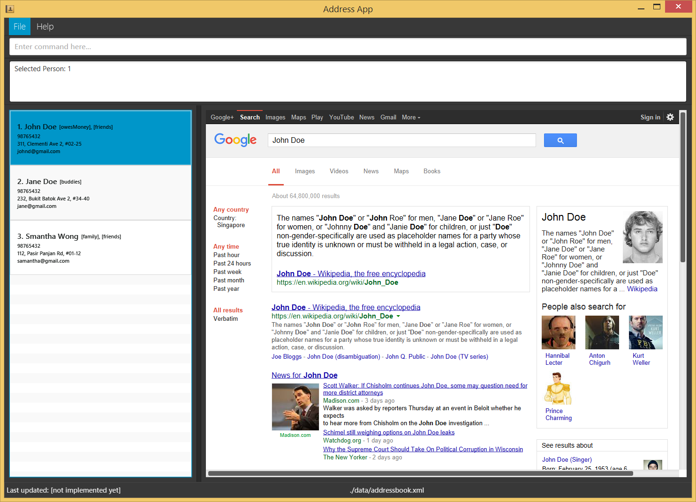

User Guide
==========

-   [Introduction](#introduction)
-   [Quick Start](#quick-start)
-   [Features](#features)
-   [FAQ](#faq)
-   [Command Summary](#command-summary)

INTRODUCTION
------------

Do you feel bombarded with 'things to do' continuously? Do you keep
forgetting stuff to do? Fear not, for you now have RubyTask! A Getting
Things Done (GTD) Tool created by TeamRuby, to help YOU get things done!

Benefits of RubyTask: Command Line Interface, One-shot Approach,
Internet-independent!

QUICK START
-----------

1.  Ensure you have Java version `1.8.0_60` or later installed in
    your computer.

> Having any Java 8 version is not enough. This application will not
> work with earlier versions of Java 8.

2.  Download the latest `RubyTask.jar` from the [releases](../../../releases) tab.

3.  Copy the file to the folder you want to use as the home folder for your RubyTask application.

4.  Double-click the file to start the application. The GUI should
    appear in a few seconds.
    >  
*Figure 1. GUI Display*

5.  Type the command in the command box and press Enter to execute it.
    e.g. typing `help` and pressing Enter will open the help window.
    Some example commands you can try:

>-   `list` : lists all tasks to do.

>-   `add`
    `Buy vegetables i/From the supermarket d/20160510 s/1400 e/1500 t/2 r/n`
    : adds a task named `Buy vegetables` to RubyTask.

>-   `delete` `Buy vegetables` : deletes the 'Buy vegetables' task
    from RubyTask.

>-   `exit` : exits RubyTask.

6.  Refer to the [Features](#features) section below for details of
    each command.

FEATURES
---------

> Command Format

>-   `Words in UPPER_CASE are the parameters.`

>-   `Items in SQUARE_BRACKETS are optional.`

>-   `Items with … after them can have multiple instances`.

>-   `The order of parameters is fixed.`

#### Viewing help: `help` 

Displays the available commands.

Format: `help`

> Help will also be shown if you enter an incorrect command e.g. `abcd`

#### Adding a task: `add`

Adds a task to RubyTask.

Format:
`add TASK i/INFORMATION d/DATE s/START_TIME e/END_TIME t/LEVEL_OF_URGENCY_TAG r/RECUR_TAG`

> Date uses YYYYMMDD format: e.g. 5 April 2016 is written as
> **20160405**\
> Time uses 24-hour format: e.g. 1pm is written as **1300**\
> Level of Urgency Tag ranges from 1 to 5\
> (**1**-Very Low Urgency, **2**-Low Urgency, **3**-Neutral, **4**-High
> Urgency, **5**-Very High Urgency)\
> Recur Tag takes in **Y** or **y** for Yes, **N** or **n** for No to
> recur weekly
>
> Examples:

-   `add Buy vegetabl``es i/From the supermarket d/``2016``1005`` s/1400 e/1500 t/2 r/n`

-   `add CS210``3T Tutorial i/Pr``epare for week 8 Tutorial d/``2016``1004`` s/2200 e/2359 t/5 r/y`

#### Listing all tasks: `list`

Shows a list of all tasks currently in RubyTask.\
Format: `list`

#### Hiding all tasks: `hide`

Hides all tasks currently in RubyTask.\
Format: `hide`

#### Finding tasks: `find`

Finds tasks which contain any of the given keywords in the task name.\
Format: `find KEYWORD [MORE_KEYWORDS]`

> Only the task name is searched (case insensitive)\
> Order of the keywords does not matter: e.g. **find**
> `CS2103T Tutorial` will match ‘`Tutorial CS2103T``’`\
> Only full words will be matched: e.g. **find** `CS2103T` will not
> match
> ‘`CS2103``’ but ``find CS2103`` will match ‘CS2103’ and ‘CS2103T’`\
> Tasks matching at least one keyword will be returned (i.e. `OR`
> search): e.g. **find** `CS2103T` will match ‘`CS2103T Tutorial``’`

Examples:

-   `find CS21``0``3``T``:` Returns ‘`CS2103``T Tutorial``’` but not
    ‘`CS2103 Tutorial``’`

-   `find CS2103T CS2101 CS3235``:` Returns any tasks having keywords
    ‘`CS2103T``’`, ‘`CS2101``’`, or ‘`CS3235``’`

#### Deleting a task: `delete`

Deletes the specified task from RubyTask.\
Format: `delete [TASK_NAME][TASK_ID]`

> Deletes the task with the specified name or at the specified `I``D``
> The name ``MUST`` match the task name (case insensitive)`\
> The ID refers to the number shown in the most recent listing and MUST
> be a positive integer:\
> i.e. 1, 2, 3, ...

Examples:

-   `list, ``delete CS2103T Tutorial``:` Deletes the ‘CS2103T Tutorial’
    task in the address book

-   `find CS2103,`` ``delete 1``:` Deletes the 1st task in the results
    of the `find` command

#### Updating a task: `update`

Updates the status of the task.\
Format: `update ``[TASK_NAME]``[TASK_ID] STATUS`

Examples:

-   `list``,` `update CS2103T Tutorial completed``:` Updates task status
    of ‘CS2103T Tutorial’ to 'completed'

-   `find CS2103T` `update 2 completed``:` Updates task status of 2nd
    task in the results of ‘CS2103T’ to 'completed'

#### Undoing a task: `undo`

Undo the latest task added/deleted/updated. Irreversible.\
Format: `undo`

> Undo ONLY the latest task added/deleted/updated: i.e Unable to undo
> tasks added 2 'adds' ago

Examples:

-   `add Buy vegetables i/From the supermarket d/05102016 s/1400 e/1500 t/2 r/n`**,**
    `undo``:` Undo latest add command, removes ‘Buy vegetables’ task

-   `find CS2103T``,` `delete 1``,` `undo`: Undo latest delete command,
    re-instates task 1 from CS2103T

#### Viewing all 'To Do' tasks: `todo`

Shows a list of tasks yet to be 'completed' in the task manager.\
Format: `todo`

#### Clearing all entries: `clear`

Clears all entries from the task manager.\
Format: `clear`

#### Exiting the program: `exit`

Exits the program.\
Format: `exit`

#### Saving the data

Data is saved in the hard disk automatically after any command that
changes it. There is no need to save manually.

FAQ
---

**Q**: The application does not start even after double-clicking the JAR
file?\
**A**: Please ensure that you have a Java version 1.8.0\_60 or later
installed in your system.

**Q**: How do I check the current Java version installed on my PC?\
**A**: Press the windows (or start menu) button, and type ‘About Java’,
hit enter. There will be a pop-up (as illustrated in Figure 2)
indicating the current Java version on your PC.

{width="3.6458333333333335in"
height="2.4879702537182853in"}\
*Figure 2. About Java pop-up*

**Q**: How do I transfer my data to another computer?\
**A**: Install the application in the other computer and overwrite the
empty data file it creates with the file that contains the data of your
previous RubyTask folder.

COMMAND SUMMARY
---------------

  **Command**   **Format**
  ------------- --------------------------------------------------------------------------------------------
  Add           `add TASK i/INFORMATION d/DATE s/START_TIME e/END_TIME t/LEVEL_OF_URGENCY_TAG r/RECUR_TAG`
  Clear         clear
  Delete        delete \[TASK\_NAME\]\[TASK\_ID\]
  Find          find KEYWORD \[MORE\_KEYWORDS\]
  Help          help
  List          list
  ToDo          todo
  Undo          undo
  Update        update \[TASK\_NAME\]\[TASK\_ID\] STATUS
